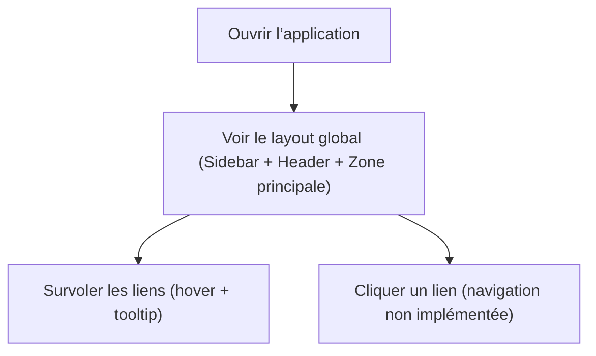

## 1. Aperçu du produit
Application web de gestion de tâches inspirée de Linear, orientée productivité et clarté, avec un style sombre par défaut.
Objectif immédiat : poser une fondation UI (layout + navigation) cohérente et prête à accueillir des modules métier.

## 2. Fonctionnalités principales

### 2.1 Rôles utilisateur
Non défini dans ce lot (fondation UI uniquement).

### 2.2 Modules fonctionnels
1. **Layout global** : Sidebar gauche + Header + zone principale.
2. **Navigation** : liens Sidebar (Dashboard, Tâches, Projets, Équipes, Notifications, Admin).
3. **Système de design** : thème sombre par défaut, tokens Tailwind, composants shadcn/ui.
4. **Base d’interaction** : hovers/transitions douces, Tooltips sur la Sidebar.
5. **Communauté & incentives (phase ultérieure)** : interactions communautaires et incentives via achievements (hors lot actuel).

### 2.3 Détails par page / zone
| Zone | Module | Description |
|------|--------|-------------|
| Layout | Sidebar | Sidebar compacte avec icônes + labels, séparateurs, tooltips, états hover, bordures subtiles. |
| Layout | Header | Barre supérieure avec titre du contexte, zone d’actions (placeholder), avatar/menu utilisateur (placeholder). |
| Layout | Zone principale | Conteneur neutre destiné à recevoir les pages (non créées dans ce lot). |

## 3. Processus cœur
Ce lot ne met en place aucun flux métier. Le parcours se limite à : ouvrir l’app → voir le layout → utiliser la navigation (liens UI).

## 4. Design UI
### 4.1 Style
- Mode : sombre par défaut.
- Fond : `bg-zinc-950` (app), surfaces `bg-zinc-900` / `bg-zinc-800`.
- Texte : `text-zinc-100` (principal), `text-zinc-400` (secondaire).
- Bordures : `border-zinc-800` (subtiles).
- Motion : transitions douces sur hover/focus, sans animation excessive.
- Références : esthétique inspirée de Linear + repo `ln-dev7/circle`.

### 4.2 Aperçu UI
| Zone | Module | Éléments UI |
|------|--------|-------------|
| Sidebar | Liens | Icône + label, `Tooltip` en mode compact, état actif (placeholder), `Separator`. |
| Header | Profil | `Avatar`, `DropdownMenu` (placeholder), `Badge` éventuel (placeholder). |
| UI système | Dialogs | `Dialog` prêt pour modales (structure uniquement, pas de contenu métier). |

### 4.3 Responsive
Desktop-first. Le responsive mobile est prévu mais non prioritaire sur ce lot (layout d’abord).
