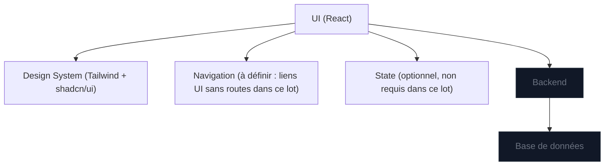

## 1. Conception d’architecture

## 2. Description des technologies
- Frontend : React + TypeScript + Vite
- Styling : Tailwind CSS (dark mode par défaut) + CSS variables
- UI : shadcn/ui (Radix UI) + lucide-react (icônes)
- Backend : Aucun (hors lot)
- Données : Aucune (hors lot)

## 3. Définition des routes
| Route | But |
|------|-----|
| / | Shell de l’application (Layout global). |
| /dashboard | Prévue (non implémentée dans ce lot). |
| /taches | Prévue (non implémentée dans ce lot). |
| /projets | Prévue (non implémentée dans ce lot). |
| /equipes | Prévue (non implémentée dans ce lot). |
| /notifications | Prévue (non implémentée dans ce lot). |
| /admin | Prévue (non implémentée dans ce lot). |

## 4. Définitions API
Non applicable (pas de backend dans ce lot).

## 5. Diagramme d’architecture serveur
Non applicable (pas de backend dans ce lot).

## 6. Modèle de données
Non applicable (pas de données dans ce lot).
